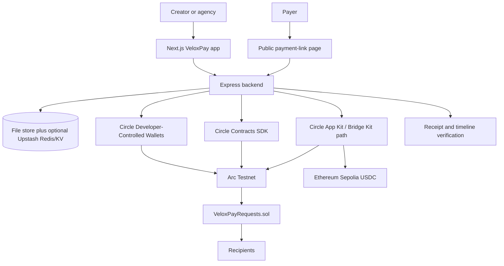

# VeloxPay

VeloxPay is a programmable payment-link product for Arc Testnet. It combines a Next.js wallet/payment workspace, a Node.js API, Circle developer-controlled wallets, Circle Contracts deployment tooling, optional Gas Station sponsorship, and a Solidity contract for Smart Requests.

## Problem

Small agencies, freelancers, and distributed service teams often receive one payment and then manually split funds, chase delivery approval, or depend on informal escrow. That creates delay, reconciliation work, and trust gaps between the payer and the people doing the work.

## Target Users

- Digital agencies that need to split client payments across contributors.
- Freelancers who want protected milestone payments.
- Clients who want proof of delivery before releasing funds.
- Operations teams that want stablecoin payment links with receipts and audit trails.

## Product Solution

VeloxPay Smart Requests are payment links that settle on Arc:

- Standard payment links settle to one recipient.
- Split payment links atomically distribute funds to several recipients.
- Protected payment links hold funds in `VeloxPayRequests` until the creator submits a deliverable and the payer approves release, or until a valid refund path is available.

The product preserves the existing VeloxPay wallet, payment-link, OTP verification, receipt, and dashboard flows while adding programmable settlement.

## Architecture



## Repository Architecture

- `veloxpay/`: primary Next.js App Router frontend with TypeScript, payment links, Smart Request creation, checkout, receipts, wallet pages, and tests.
- `backend/server/`: Express CommonJS API for wallets, OTP, sessions, Circle calls, Redis/KV helpers, payment links, Smart Requests, receipts, bridge recovery, and polling.
- `contracts/`: Foundry workspace for `VeloxPayRequests.sol`, tests, Circle Contracts deployment helpers, ABI/bytecode artifacts, and deployment metadata.
- `frontend/`: legacy Vite wallet client. Keep it buildable, but the hackathon demo should use `veloxpay/`.
- `docs/`: focused notes for Gas Station and bridge recovery.

## Smart Request Modes

- `STANDARD`: one recipient, payer funds the request, contract settles immediately.
- `SPLIT`: up to 10 recipients, allocations must total exactly 10,000 basis points, contract settles atomically when paid.
- `PROTECTED`: one or more recipients, funds stay in the Arc contract after funding, creator submits a deliverable hash, payer approves release, creator can voluntarily refund, and payer can refund after expiry only if no deliverable was submitted before the deadline.

All token accounting uses integer base units internally. USDC and EURC use 6 decimals in the current Arc Testnet configuration.

## Arc Usage

- Arc Testnet is the settlement network.
- USDC and EURC balances, transfers, explorer links, receipt transaction hashes, and Smart Request contract state are represented as Arc activity.
- The contract is configured for Arc Testnet deployment with Foundry and Circle Contracts.
- Arc Testnet USDC address currently used by the app: `0x3600000000000000000000000000000000000000`.
- EURC is Arc-only in this phase.

## Circle Usage

### Circle Wallets

The backend uses `@circle-fin/developer-controlled-wallets` when `CIRCLE_API_KEY` and `CIRCLE_ENTITY_SECRET` are present. Wallet creation/restoration and contract transactions stay server-side. Circle secrets are never exposed to `NEXT_PUBLIC_*` frontend code.

### Circle Contracts

The `contracts/deploy/deploy-arc-testnet.mjs` script uses `@circle-fin/smart-contract-platform` to deploy `VeloxPayRequests` with blockchain value `ARC-TESTNET`, poll the deployment transaction, fetch the final contract address and Circle contract ID, then whitelist USDC and EURC.

### Gas Station

Smart Request transactions preserve the normal fee-estimation flow. Gas Station is only displayed as sponsored after Circle confirms sponsorship in the completed transaction response. Unsupported wallets and policy misses fall back to standard Arc fee handling.

Configuration notes are in `docs/circle-gas-station-arc-testnet.md`.

### Bridge Kit / CCTP

The optional cross-chain flow supports exactly one source route in this phase:

- Source: Ethereum Sepolia
- Destination: Arc Testnet
- Token: USDC only

Bridge quote, step state, transaction hashes, recoverable errors, and explorer links are persisted. VeloxPay does not start Smart Request payment until the Arc USDC balance is confirmed. Recovery notes are in `docs/smart-request-bridge-recovery.md`.

## Deployed Arc Testnet Contract

No final deployment artifact is currently committed at:

```text
contracts/deployments/arc-testnet/VeloxPayRequests.deployment.json
```

That means the README cannot honestly list a deployed contract address or deployment transaction yet. After deployment, update this section from the generated artifact:

- Contract address: `TBD - run npm run contracts:deploy:arc-testnet`
- Circle contract ID: `TBD`
- Deployment transaction ID/hash: `TBD`
- Chain ID: `5042002`
- ABI artifact: `contracts/deployments/arc-testnet/VeloxPayRequests.build.json`

## Testnet Setup

1. Create a Circle developer account and configure developer-controlled wallets.
2. Enable Arc Testnet wallets and, if available, Smart Contract Account wallets for Gas Station eligibility.
3. Copy `contracts/.env.arc-testnet.example` to `contracts/.env`.
4. Fill in Circle server-only values and Arc token addresses.
5. Run:

```bash
npm --prefix contracts install
npm run contracts:fmt:check
npm run contracts:test
npm run contracts:build
npm run contracts:artifacts
npm run contracts:deploy:arc-testnet -- --dry-run
npm run contracts:deploy:arc-testnet
```

6. Copy the generated contract address into backend env as `VELOXPAY_REQUESTS_CONTRACT_ADDRESS`.
7. Fund test wallets from the Circle faucet at `https://faucet.circle.com/` using Arc Testnet USDC or EURC.

## Environment Variables

Backend, in `backend/server/.env` or hosting provider config:

```bash
ARC_RPC=https://rpc.testnet.arc.network
FRONTEND_ORIGIN=http://localhost:3000
PAYMENT_LINK_BASE_URL=http://localhost:3000
WALLET_APP_BASE_URL=http://localhost:3000
PAYMENT_LINK_SIGNING_SECRET=replace-with-random-secret
REQUIRE_WALLET_SESSION=true

UPSTASH_REDIS_REST_URL=
UPSTASH_REDIS_REST_TOKEN=

CIRCLE_API_URL=https://api.circle.com
CIRCLE_API_KEY=
CIRCLE_ENTITY_SECRET=
CIRCLE_WALLET_SET_ID=
CIRCLE_WALLET_SET_NAME=VeloxPay Wallet Set
CIRCLE_BLOCKCHAIN=ARC-TESTNET
CIRCLE_GAS_STATION_ENABLED=true
VELOXPAY_REQUESTS_CONTRACT_ADDRESS=

CIRCLE_USER_CONTROLLED_APP_ID=
ARC_APP_KIT_KEY=

SMTP_HOST=
SMTP_PORT=465
SMTP_SECURE=true
SMTP_USER=
SMTP_PASS=
OTP_FROM_EMAIL="VeloxPay <no-reply@example.com>"
```

Frontend, in `veloxpay/.env.local`:

```bash
BACKEND_API_URL=http://localhost:4000
NEXT_PUBLIC_BACKEND_API_URL=http://localhost:4000
NEXT_PUBLIC_BUILDER_X_URL=https://x.com/cryptosmart121
```

Contract deployment, in `contracts/.env`:

```bash
ARC_TESTNET_RPC_URL=https://rpc.testnet.arc.network
CIRCLE_API_KEY=
CIRCLE_ENTITY_SECRET=
VELOXPAY_ARC_TESTNET_DEPLOYER_WALLET_ID=
VELOXPAY_ARC_TESTNET_USDC_ADDRESS=0x3600000000000000000000000000000000000000
VELOXPAY_ARC_TESTNET_EURC_ADDRESS=
VELOXPAY_ARC_TESTNET_DEPLOY_IDEMPOTENCY_KEY=
VELOXPAY_ARC_TESTNET_USDC_APPROVAL_IDEMPOTENCY_KEY=
VELOXPAY_ARC_TESTNET_EURC_APPROVAL_IDEMPOTENCY_KEY=
```

Never put Circle API keys, entity secrets, Redis credentials, wallet credentials, or private keys in frontend `NEXT_PUBLIC_*` variables.

## Local Development

Install dependencies:

```bash
npm --prefix backend/server install
npm --prefix veloxpay install
npm --prefix frontend install
npm --prefix contracts install
```

Start the backend:

```bash
npm run backend:dev
```

Start the primary frontend:

```bash
npm run app:dev
```

Optional legacy frontend:

```bash
npm run legacy:dev
```

## Demo Seed

The agency demo script creates a realistic protected Smart Request through the real backend endpoint. It does not mark anything funded, settled, released, or refunded, and it does not bypass contract execution. Funding and approval must still happen through the live Circle/Arc payment flow.

Default scenario:

- Total: `1,000 USDC`
- Developer: `60%`
- Designer: `20%`
- Project manager: `10%`
- Agency treasury: `10%`
- Mode: `protected`
- Deliverable: `website-development`

Run a dry run:

```bash
npm run demo:seed:agency -- --dry-run
```

Create the request against a running backend:

```bash
npm run backend:dev
npm run demo:seed:agency
```

Useful overrides:

```bash
DEMO_BACKEND_URL=http://localhost:4000
DEMO_CREATOR_EMAIL=agency-owner@example.com
DEMO_CREATOR_NAME="Northstar Studio"
DEMO_WALLET_SESSION_TOKEN=your-session-token-if-required
DEMO_PAYER_EMAIL=client@example.com
DEMO_DEVELOPER_WALLET_ADDRESS=0x...
DEMO_DESIGNER_WALLET_ADDRESS=0x...
DEMO_PROJECT_MANAGER_WALLET_ADDRESS=0x...
DEMO_AGENCY_TREASURY_WALLET_ADDRESS=0x...
```

If `REQUIRE_WALLET_SESSION=true`, sign in through the VeloxPay app first and pass a valid creator wallet session token.

## Testing

Primary checks:

```bash
npm run backend:test
npm run contracts:fmt:check
npm run contracts:test
npm run contracts:build
npm run app:lint
npm run app:test
npm run app:build
```

Legacy client checks:

```bash
npm run legacy:lint
npm run legacy:build
```

## Security Limitations

- This is testnet software and has not had an external audit.
- Redis/KV persistence helpers are not a full transactional database. Production should move critical Smart Request state transitions to atomic writes or a durable relational/event store.
- Bridge recovery persists emitted steps and transaction hashes, but full CCTP/App Kit recovery may still require Circle Console or provider support.
- Receipt verification compares canonical metadata hashes and contract state available to the backend, but a production system should add an independent indexer.
- Deadline logic uses ISO timestamps offchain and `block.timestamp` onchain. UI copy should keep timezone expectations explicit.
- Only owner-approved tokens should be whitelisted. The contract rejects fee-on-transfer balance deltas, but production token onboarding should still include token behavior review.
- Secrets must remain server-side. Never expose Circle API keys, entity secrets, Redis credentials, wallet credentials, or private keys to client-side code.

## Production Roadmap

- Deploy and verify the Arc Testnet contract, then add the final contract address and deployment transaction above.
- Add an event indexer for contract events, receipt verification, and reconciliation.
- Replace file-store demo persistence with transactional production storage.
- Add richer role-based dashboards for agencies, payers, and recipients.
- Expand Bridge Kit/CCTP recovery with provider-native retry context.
- Add contract monitoring, admin runbooks, and incident controls for pausing/unpausing.
- Add external security review before mainnet or production funds.
- Add more source networks only after the Ethereum Sepolia to Arc Testnet USDC route is fully verified.
